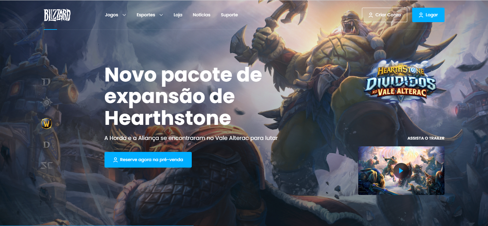

<h1 align="center">
  🚀 Redesenho do Site da Blizzard
</h1>

  
  
  
  
  
  

  

  <a href="#rocket-tecnologias">Tecnologias</a>&nbsp;&nbsp;&nbsp;|&nbsp;&nbsp;&nbsp;
  <a href="#-projeto">Projeto</a>&nbsp;&nbsp;&nbsp;|&nbsp;&nbsp;&nbsp;
  <a href="#-funcionalidades">Funcionalidades</a>&nbsp;&nbsp;&nbsp;|&nbsp;&nbsp;&nbsp;
  <a href="#-requisitos">Requisitos</a>&nbsp;&nbsp;&nbsp;|&nbsp;&nbsp;&nbsp;
  <a href="#-instalação">Instalação</a>&nbsp;&nbsp;&nbsp;|&nbsp;&nbsp;&nbsp;

 

[Clique aqui para acessar o projeto online](https://lp-blizard.netlify.app)

 

  

## :rocket: Tecnologias

Esse projeto foi desenvolvido com as seguintes tecnologias:

- [HTML5](https://html5.org/)
- [CSS3](https://www.w3.org/Style/CSS/Overview.en.html)
- [Javascript](https://www.javascript.com/)
- [SCSS](https://sass-lang.com/)
- [Google Fonts](https://fonts.google.com/)
- [Swipper.js](https://swiperjs.com/)
- [AOS.js](https://michalsnik.github.io/aos/)
- [Gulp.js](https://gulpjs.com/)

## 💻 Projeto

Esse projeto é um redesenho do site institucional do site da produtora de jogos Blizzard como projeto prático do curso de 
desenvolvedor frontend da Codeboost.

## ✅ Funcionalidades

- O sistema possui possui design 100% responsivo usando breakpoints para adaptação do layout aos dife
rentes dispositivos existentes. 

- Faz uso do CSS para maior organização e modulação do projeto. 

- Possui para transiçao de slides(swipper.js) na parte de comentários de usuários, 

- Usa a biblioteca AOS.js para adicionar animações de entrada a imagens e textos.

- Utiliza CSS keyframes para animar imagens específicas para melhorar a experiência do usuário.

- Utilização de meta tags de compartilhamento para melhorar a visualização do site em redes sociais.

## 📄 Requisitos para instalação do projeto

- Navegador moderno atualizado para acesso ao site como Chrome, Firefox, Edge, Safari, Opera e etc.

- Gulp instalado na máquina

## ⚙️ Instalação e execução

**Windows, OS X & Linux:**

Baixe o arquivo zip e o descompacte ou baixe o projeto para sua máquina através do git clone [https://github.com/randercarlos/lp-blizzard.git](https://github.com/randercarlos/lp-blizzard.git)

- Navegue até a pasta do projeto :
`cd pasta-do-projeto`

- Rodar o automatizador de tarefas gulp na raiz do projeto com o comando:
`gulp`

- Acessar o site em:
`http://localhost:3000/`

Desenvolvido por Rander Carlos :wave: 

